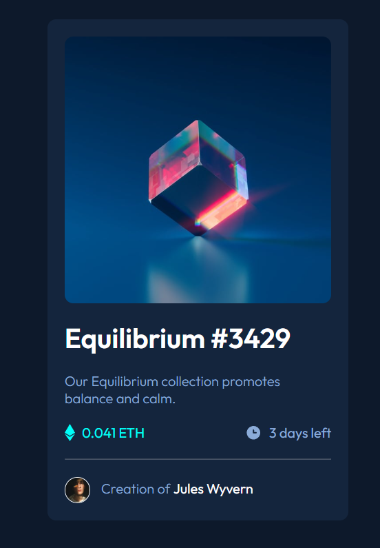
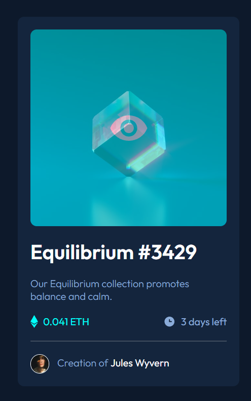

# Frontend Mentor - NFT preview card component solution

This is a solution to the [NFT preview card component challenge on Frontend Mentor](https://www.frontendmentor.io/challenges/nft-preview-card-component-SbdUL_w0U). Frontend Mentor challenges help you improve your coding skills by building realistic projects. 

## Table of contents

- [Overview](#overview)
  - [The challenge](#the-challenge)
  - [Screenshot](#screenshot)
  - [Links](#links)
- [My process](#my-process)
  - [Built with](#built-with)
  - [What I learned](#what-i-learned)
  - [Continued development](#continued-development)
  - [Useful resources](#useful-resources)
- [Author](#author)

## Overview

### The challenge

Users should be able to:

- View the optimal layout depending on their device's screen size
- See hover states for interactive elements

### Screenshot

### Links

- Solution URL: [Solution](https://www.frontendmentor.io/solutions/nft-card-preview-ZXndDGhaR3)
- Live Site URL: [Live URL](https://drmetr.github.io/NFT-preview-card/)

## My process

### Built with

- Semantic HTML5 markup
- CSS custom properties
- Flexbox

### What I learned

I started this challenge with an idea of adding a JS script that would scrape info about etherium price from a certain website and then update the price in in accordance with relevant prices. Unfortunately, after spending an evening trying to follow multiple guides and stackoverflow dicussions I came to a conclusion that I should postpone this part of the project until I get comfortable with async/await, node.js and axios and cheerio or other webscrapping tools.

### Continued development

To learn async/await, node.js and axios and cheerio. I plan to re-upload the result later.

### Useful resources

- [How to Apply Borders to Clip Paths with CSS](https://www.freecodecamp.org/news/apply-borders-to-clip-paths-with-css/) - This didn't help me anywhere but I've encountered it during my researches.
- [How to Web Scrape With JavaScript & Node.js (Step by Step)](https://www.scraperapi.com/web-scraping/javascript/) - the guide I used to build the scraper but it doesn't explain how to use the data obtained in furhter work, i.e. not for beginners like me.

## Author

- Website - [DrMetr](https://github.com/DrMetr)
- Frontend Mentor - [@DrMetr](https://www.frontendmentor.io/profile/DrMetr)
